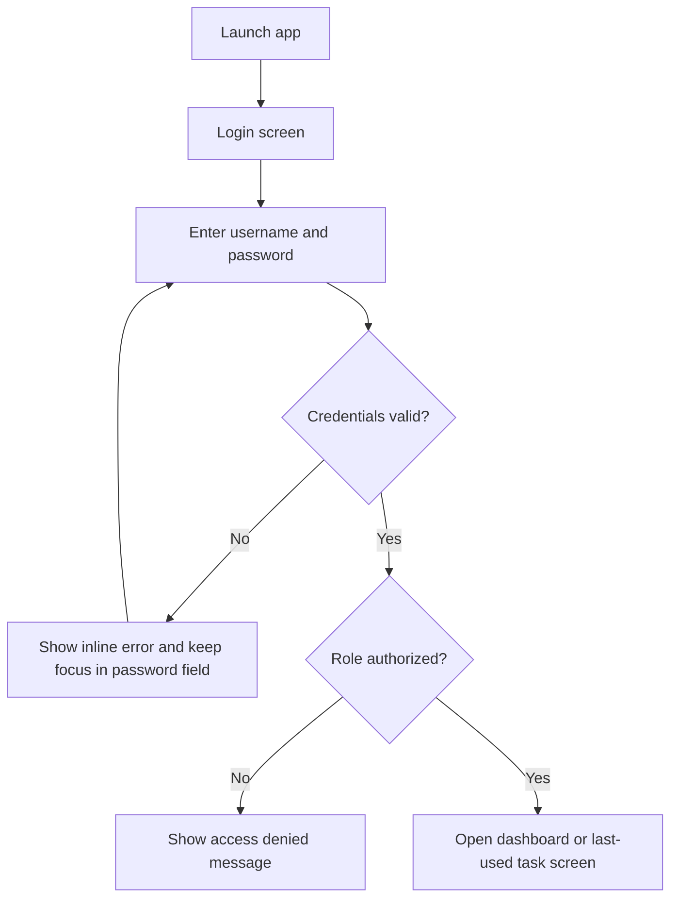
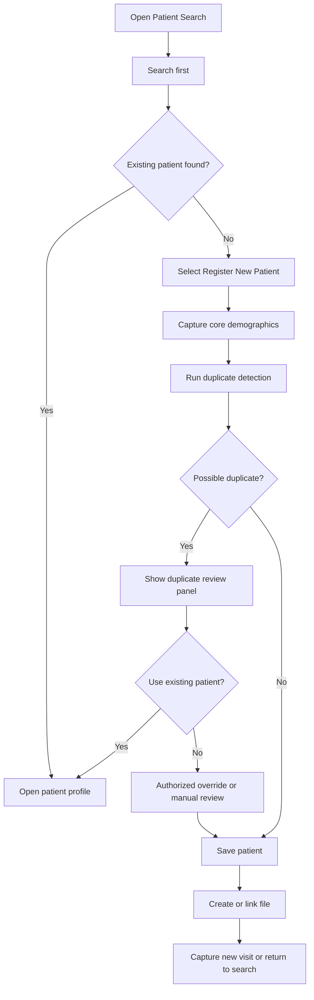
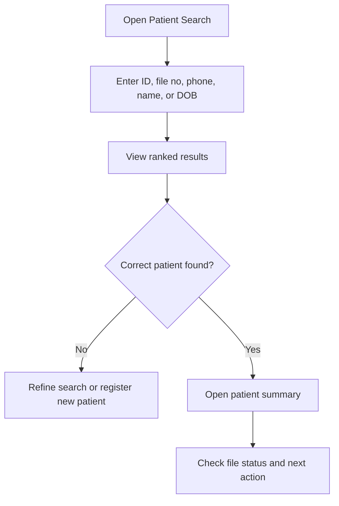
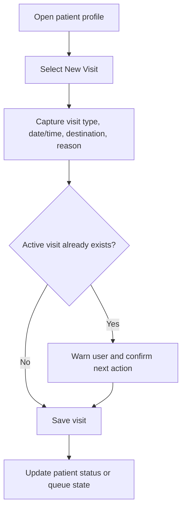
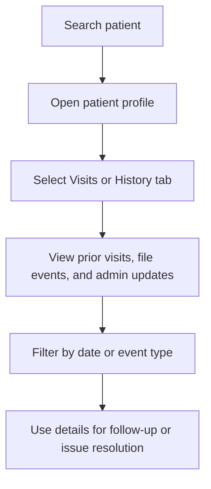

# Clinic Administration

WPF desktop application for South African public clinics focused on fast patient registration, duplicate prevention, rapid search, and physical file tracking.

## Core workflows

### Login

### New patient registration

### Existing patient search

### New visit capture

### Patient history retrieval

## Solution layout

- `src/ClinicAdmin.Desktop`: WPF presentation layer
- `src/ClinicAdmin.Application`: use cases, interfaces, validation, orchestration
- `src/ClinicAdmin.Domain`: core entities and business rules
- `src/ClinicAdmin.Infrastructure`: EF Core, persistence, logging, security, configuration
- `src/ClinicAdmin.Contracts`: DTOs and contracts shared across boundaries
- `tests/*`: unit and integration test projects
- `docs/*`: architecture and discovery documentation

## Notes

- Production database target: PostgreSQL
- Development/demo database target: SQLite
- Architecture guidance lives in `docs/architecture/architecture-overview.md`
- Initial internal folder plan lives in `docs/architecture/solution-structure.md`
