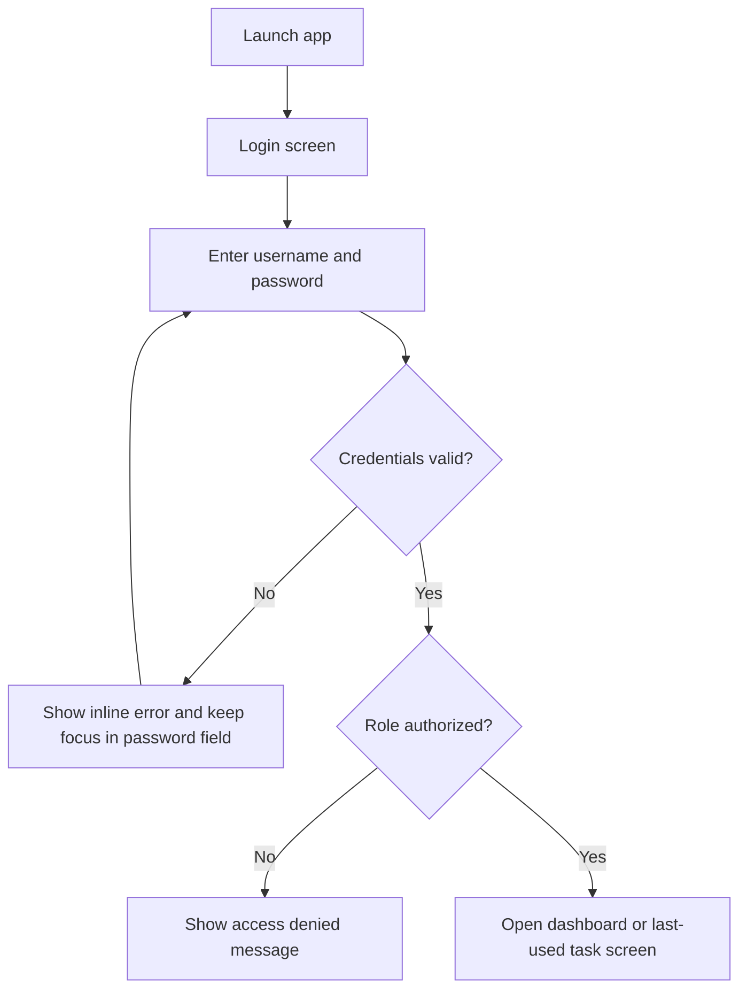
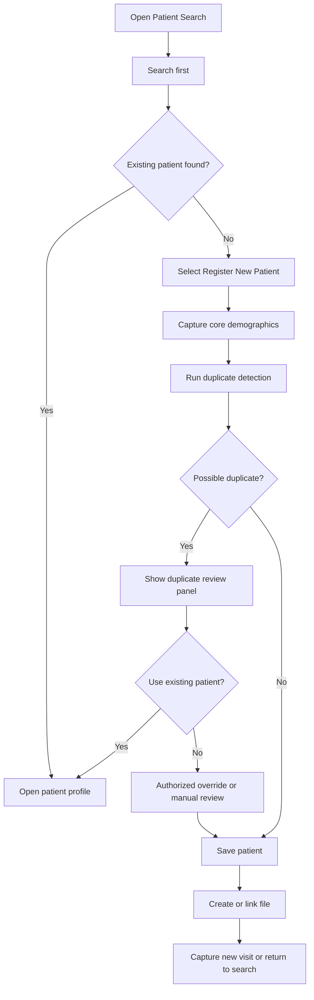
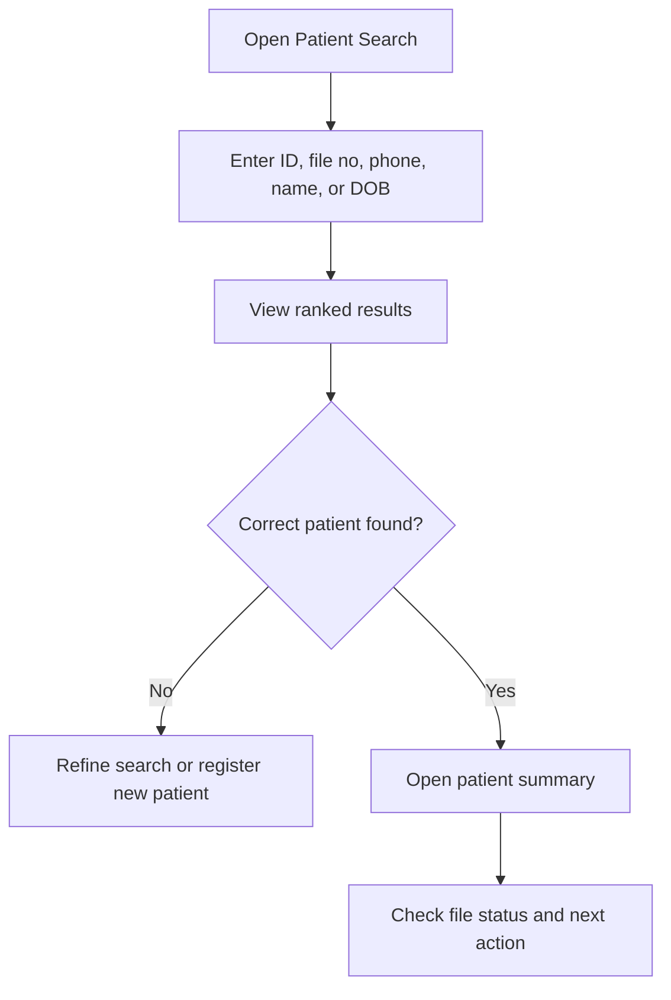
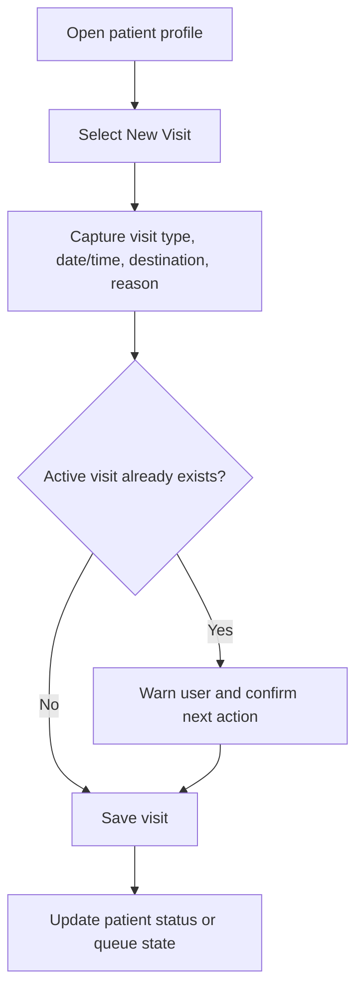
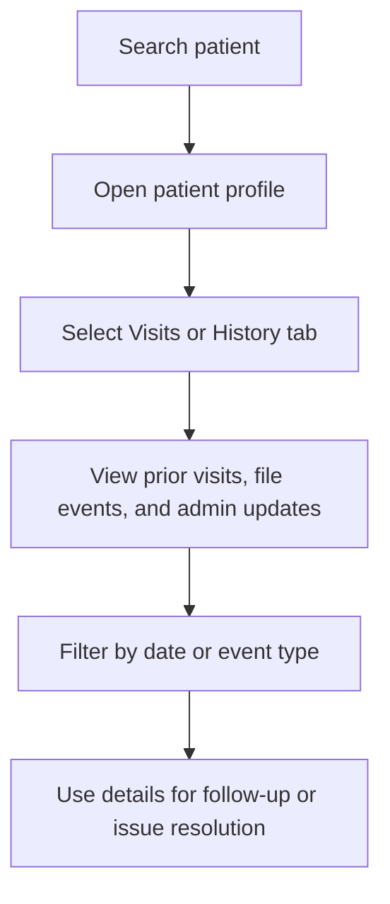

# Clinic Administration Desktop Application

Production-oriented WPF desktop application for South African public clinics and hospitals, designed to reduce patient registration delays, prevent duplicate records, improve file retrieval, and create a reliable administrative foundation for future clinic digitisation.

## Project Overview

This project is a desktop-first clinic administration system built for high-pressure reception and records environments where speed, clarity, and reliability matter more than feature volume. The application focuses on the administrative bottlenecks that most directly affect waiting times:

- fast patient search
- rapid new patient registration
- duplicate patient prevention
- visit capture
- auditability
- operational reporting

The current implementation is structured as a modular .NET 8 WPF application using MVVM, EF Core, SQLite for local development, and PostgreSQL as the intended production database.

## Problem Being Solved

In many public clinics, reception staff still capture patient information on paper first and then recapture it into a computer later. Physical files may be difficult to locate, patients are often asked for the same information repeatedly, and duplicate patient records are created when search and verification are weak.

These issues lead to:

- long queues at reception
- duplicate work for staff
- missing or misfiled records
- poor data quality
- patient frustration
- weak operational accountability

This application addresses those problems by moving clinics toward a single-pass, search-first, auditable registration workflow optimized for front-desk use.

## Design Thinking Approach

The system was planned using a design thinking workflow to keep the implementation anchored in real clinic operations rather than generic CRUD software.

### 1. Empathize

The project began by examining the likely daily experiences of:

- patients
- reception and admin clerks
- nurses
- doctors
- clinic managers

The main empathy insight was that the bottleneck is not just paper capture. It is the repeated breakdown between patient identification, file retrieval, and handoff to the next service point.

### 2. Define

The problem was reframed as:

> How do we create a fast, reliable, auditable clinic administration experience that reduces repeat data capture, prevents duplicate patients, improves file traceability, and shortens queue times in constrained public healthcare environments?

### 3. Ideate

Multiple concepts were considered, including hybrid paper-to-digital models and broader clinic-flow systems. The selected MVP direction was a reception-first desktop system focused on search, registration, duplicate prevention, and visit capture.

### 4. Prototype

The application UX was shaped around keyboard-first, low-clutter, staff-friendly workflows with search-first navigation and concise task screens.

### 5. Test

The solution includes unit, integration, and view-model test coverage, along with a documented testing strategy for QA expansion and deployment readiness.

## Key Features

### Current MVP / working foundation

- secure login with role-based navigation
- password hashing using PBKDF2
- patient registration workflow
- duplicate patient prevention and detection
- patient search with partial matching
- patient profile and summary retrieval
- visit / encounter capture workflow
- audit trail for administrative actions and login attempts
- operational reporting
- CSV report export
- environment-based configuration
- production-oriented structured logging with Serilog

### User-facing workflow highlights

- search-first patient retrieval
- fast capture of core patient demographics
- duplicate warning review before patient creation
- quick visit registration for arrivals
- manager/admin audit and reporting views

## Core Workflows

### Login



### New Patient Registration



### Existing Patient Search



### New Visit Capture



### Patient History Retrieval



## Architecture Overview

The solution follows a layered desktop architecture:

- `ClinicAdmin.Desktop`
  WPF presentation layer, views, view models, commands, styles, UI services
- `ClinicAdmin.Application`
  use cases, orchestration, validation, reports, search services, abstractions
- `ClinicAdmin.Domain`
  entities, enums, value objects, invariants, core rules
- `ClinicAdmin.Infrastructure`
  EF Core persistence, security implementations, auditing, logging, configuration
- `ClinicAdmin.Contracts`
  DTOs and contracts exchanged across boundaries

Architectural principles:

- MVVM for UI separation
- clean separation of concerns
- CQRS-lite between read-heavy and write workflows
- explicit abstractions for time, facility context, auditing, user session, and sync seams
- modular monolith, not microservices

Additional detail:

- [Architecture Overview](docs/architecture/architecture-overview.md)
- [Solution Structure](docs/architecture/solution-structure.md)

## Technology Stack

- C#
- .NET 8
- WPF
- MVVM
- Entity Framework Core
- SQLite for local development and demo
- PostgreSQL for production
- xUnit for automated testing
- Serilog for structured logging

## Repository Structure

```text
src/
  ClinicAdmin.Desktop/
  ClinicAdmin.Application/
  ClinicAdmin.Domain/
  ClinicAdmin.Infrastructure/
  ClinicAdmin.Contracts/
tests/
  ClinicAdmin.Domain.Tests/
  ClinicAdmin.Application.Tests/
  ClinicAdmin.Infrastructure.Tests/
  ClinicAdmin.Desktop.Tests/
docs/
  architecture/
  deployment/
  testing/
  discovery/
  ux/
```

## Setup Instructions

### Prerequisites

- Windows machine for running the WPF desktop client
- .NET 8 SDK
- SQLite for local development or PostgreSQL for production/staging
- Visual Studio 2022 or JetBrains Rider recommended

### Clone the repository

```powershell
git clone <repository-url>
cd clinic-admin
```

### Restore dependencies

```powershell
dotnet restore
```

## Database Setup

### Local development

The default local development configuration uses SQLite.

Relevant file:

- [appsettings.Development.json](src/ClinicAdmin.Desktop/appsettings.Development.json)

Default development provider:

- `Database:Provider = Sqlite`
- local file database such as `clinic-admin-dev.db`

### Production / staging

Production is intended to run on PostgreSQL.

Relevant file:

- [appsettings.Production.json](src/ClinicAdmin.Desktop/appsettings.Production.json)

Important note:

- The application is currently still using `EnsureCreatedAsync()` during initialization.
- Real EF Core migrations have not yet been checked in.
- Before production rollout, create and validate the initial migrations set.

Deployment and migration guidance:

- [Single-Clinic Deployment Guide](docs/deployment/single-clinic-deployment.md)

## Running the Application

### Development

```powershell
$env:DOTNET_ENVIRONMENT="Development"
dotnet run --project src/ClinicAdmin.Desktop
```

### Production-style local run

```powershell
$env:DOTNET_ENVIRONMENT="Production"
dotnet run --project src/ClinicAdmin.Desktop
```

## Testing Instructions

Run all tests:

```powershell
dotnet test
```

Run a single test project:

```powershell
dotnet test tests/ClinicAdmin.Application.Tests
```

Current testing scope includes:

- domain tests
- application service tests
- infrastructure security and audit tests
- desktop view-model tests
- integration-style workflow tests

Testing strategy:

- [Testing Strategy](docs/testing/testing-strategy.md)

## Deployment Summary

The recommended first deployment model is a single-clinic installation:

- WPF app installed on clinic workstations
- PostgreSQL hosted on a local clinic server or secure on-prem host
- environment-specific config
- seeded demo users disabled in production
- structured file logging enabled
- backup and restore plan required before go-live

Detailed runbook:

- [Single-Clinic Deployment Guide](docs/deployment/single-clinic-deployment.md)

## Screenshots

Screenshots can be added here once the UI is captured from a runtime environment.

### Placeholder list

- `docs/screenshots/login-screen.png`
- `docs/screenshots/patient-search.png`
- `docs/screenshots/patient-registration.png`
- `docs/screenshots/visit-capture.png`
- `docs/screenshots/audit-log.png`
- `docs/screenshots/reports-dashboard.png`

## Documentation Set

- [Architecture Overview](docs/architecture/architecture-overview.md)
- [Single-Clinic Deployment Guide](docs/deployment/single-clinic-deployment.md)
- [Testing Strategy](docs/testing/testing-strategy.md)
- [Technical Documentation](docs/technical-documentation.md)

## Future Roadmap

Short-term:

- proper EF Core migrations
- file management workflow completion
- richer role-based administrative screens
- improved session timeout and workstation hardening
- full runtime verification of refined WPF UX

Medium-term:

- barcode-based file lookup
- improved queue-state workflows
- stronger operational dashboards
- PDF export
- richer file movement tracking

Long-term:

- multi-clinic support
- sync / branch-aware data exchange
- hardware integration such as scanners and label printing
- broader hospital administration expansion
